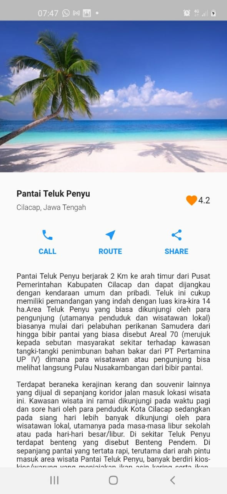

# flutter_basic

A new Flutter project.

## Getting Started




## Sources
- edit pubspec.yaml
    ```yaml
    # To add assets to your application, add an assets section, like this:
    assets:
    - assets/beach.jpg
    ```
- main.dart
    ```dart
    import "package:flutter/material.dart";
    import 'home_page.dart';
    
    void main() => runApp(MyApp());
    
    class MyApp extends StatelessWidget {
      @override
      Widget build(BuildContext context) {
        return MaterialApp(
          debugShowCheckedModeBanner: false,
          home: HomePage(),
        );
      }
    }
    ```

- home_page.dart
    ```dart
    import "package:flutter/material.dart";
    
    class HomePage extends StatelessWidget {
      @override
      Widget build(BuildContext context) {
        return Scaffold(
          body: SafeArea(
           child: SingleChildScrollView(
               child: Column(
                 crossAxisAlignment: CrossAxisAlignment.start,
                 children: [
                   Image.asset('assets/beach.jpg'),
                   SizedBox(
                     height: 30,
                   ),
                   Padding(
                     padding: EdgeInsets.symmetric(horizontal: 30),
                     child: Row(
                       mainAxisAlignment: MainAxisAlignment.spaceBetween,
                       children: [
                         Column(
                           crossAxisAlignment: CrossAxisAlignment.start,
                           children: [
                             Text(
                               "Pantai Teluk Penyu",
                               style: TextStyle(
                                   fontWeight: FontWeight.bold
                               ),
                             ),
                             SizedBox(
                               height: 8,
                             ),
                             Text(
                               "Cilacap, Jawa Tengah",
                               style: TextStyle(
                                   fontWeight: FontWeight.w300,
                                   fontSize: 12
                               ),
    
                             )
                           ],
                         ),
                         Row(
                           children: [
                             Icon(
                               Icons.favorite,
                               color: Color(0xffFF8800),
                             ),
                             Text("4.2")
                           ],
                         ),
                       ],
                     ),
                   ),
                   SizedBox(height: 30,),
                   Padding(
                     padding: EdgeInsets.symmetric(horizontal: 70),
                     child: Row(
                       mainAxisAlignment: MainAxisAlignment.spaceBetween,
                       crossAxisAlignment: CrossAxisAlignment.start,
                       children: [
                         Column(
                           children: [
                             Icon(
                               Icons.phone,
                               color: Colors.blue,
                             ),
                             SizedBox(height: 10,),
                             Text(
                               "CALL",
                               style: TextStyle(
                                 fontWeight: FontWeight.w900,
                                 color: Colors.blue,
                                 fontSize: 12,
                               ),
                             ),
                           ],
                         ),
                         Column(
                           children: [
                             Icon(
                               Icons.near_me_sharp,
                               color: Colors.blue,
                             ),
                             SizedBox(height: 10,),
                             Text(
                                 "ROUTE",
                                 style: TextStyle(
                                   fontWeight: FontWeight.w900,
                                   color: Colors.blue,
                                   fontSize: 12,
                                 )
                             )
                           ],
                         ),
                         Column(
                           children: [
                             Icon(
                               Icons.share,
                               color: Colors.blue,
                             ),
                             SizedBox(height: 10,),
                             Text(
                               "SHARE",
                               style: TextStyle(
                                 fontWeight: FontWeight.w900,
                                 color: Colors.blue,
                                 fontSize: 12,
                               ),
                             )
                           ],
                         ),
                       ],
                     ),
                   ),
                   SizedBox(height: 30,),
                   Padding(
                     padding: EdgeInsets.symmetric(horizontal: 30),
                     child: Text(
                         "Pantai Teluk Penyu berjarak 2 Km ke arah timur dari Pusat Pemerintahan Kabupaten Cilacap dan dapat dijangkau dengan kendaraan umum dan pribadi. Teluk ini cukup memiliki pemandangan yang indah dengan luas kira-kira 14 ha.Area Teluk Penyu yang biasa dikunjungi oleh para pengunjung (utamanya penduduk dan wisatawan lokal) biasanya mulai dari pelabuhan perikanan Samudera dari hingga bibir pantai yang biasa disebut Areal 70 (merujuk kepada sebutan masyarakat sekitar terhadap kawasan tangki-tangki penimbunan bahan bakar dari PT Pertamina UP IV) dimana para wisatawan atau pengunjung bisa melihat langsung Pulau Nusakambangan dari bibir pantai.\n\nTerdapat beraneka kerajinan kerang dan souvenir lainnya yang dijual di sepanjang koridor jalan masuk lokasi wisata ini. Kawasan wisata ini ramai dikunjungi pada waktu pagi dan sore hari oleh para penduduk Kota Cilacap sedangkan pada siang hari lebih banyak dikunjungi oleh para wisatawan lokal, utamanya pada masa-masa libur sekolah atau pada hari-hari besar/libur. Di sekitar Teluk Penyu terdapat benteng yang disebut Benteng Pendem. Di sepanjang pantai yang tertata rapi, terutama dari arah pintu masuk area wisata Pantai Teluk Penyu, banyak berdiri kios-kios/warung yang menjajakan ikan asin kering serta ikan-ikan segar/basah yang siap langsung dibakar atau dimasak sesuai dengan keinginan pengunjung.",
                       style: TextStyle(
                         fontSize: 12
                       ),
                       textAlign: TextAlign.justify,
    
                     ),
                   ),
                 ],
               )
           ),
          ),
        );
      }
    }
    ```

This project is a starting point for a Flutter application.

A few resources to get you started if this is your first Flutter project:

- [Lab: Write your first Flutter app](https://flutter.dev/docs/get-started/codelab)
- [Cookbook: Useful Flutter samples](https://flutter.dev/docs/cookbook)

For help getting started with Flutter, view our
[online documentation](https://flutter.dev/docs), which offers tutorials,
samples, guidance on mobile development, and a full API reference.
